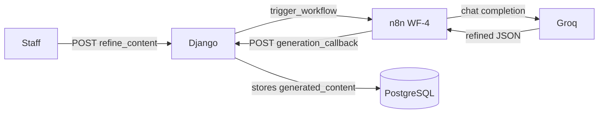
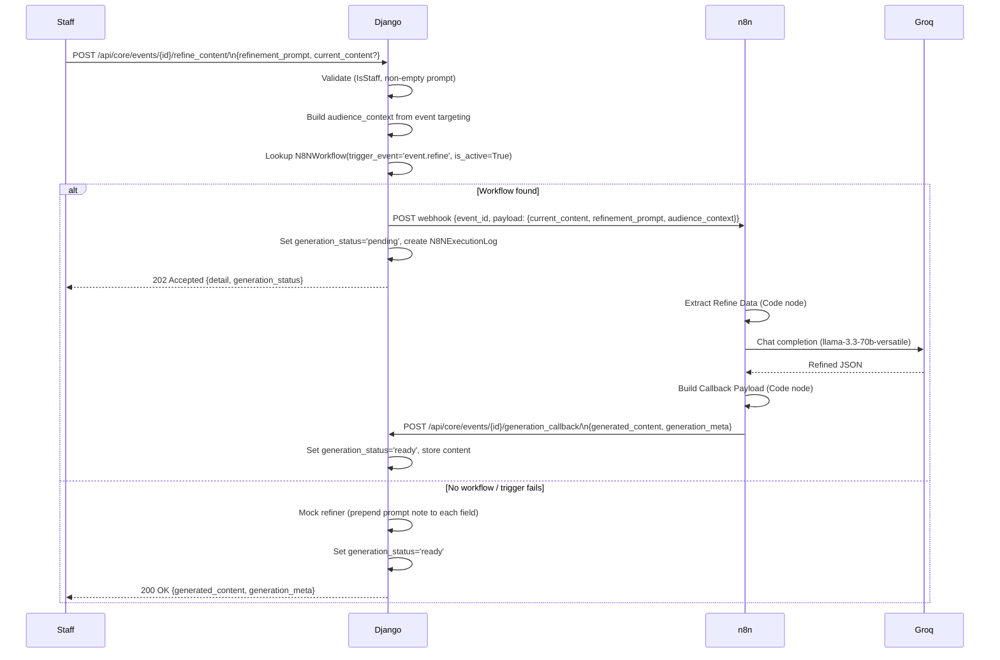

# Design Document: Event Content Refiner (WF-4)

## Overview

WF-4 extends the existing Event Content Generator (WF-1) by adding a staff-facing refinement loop. A staff member submits a natural-language `refinement_prompt` against an event's existing `generated_content`; the Django backend forwards the request to an n8n workflow that calls Groq, and the refined content is written back through the existing `generation_callback` endpoint.

The feature touches three layers:
- **Django backend** — replaces the `refine_content` stub action, adds a `register_wf4` management command
- **n8n** — a new WF-4 workflow (built manually by the developer using the node spec below)
- **Frontend** — a refinement panel on the event detail page (separate pass, not in scope here)

### Key Design Decisions

1. **Reuse `generation_callback` for write-back** — WF-4 calls the same Phase 2 callback as WF-1. No new endpoint needed; `generation_meta.generated_by = 'n8n-groq-refine'` distinguishes refine traffic from generate traffic.
2. **POST replaces PUT** — The existing `refine_content` action is a PUT stub that directly overwrites fields. It is replaced with a POST action that triggers n8n asynchronously, matching the WF-1 pattern.
3. **Mock fallback** — When no active `event.refine` workflow is registered, a local mock refiner runs synchronously and returns HTTP 200, enabling end-to-end testing without n8n.
4. **`refine_chatbot` is untouched** — That action uses a different webhook (`N8N_REFINE_WEBHOOK` setting) and a chatbot interaction model. It coexists with the new `refine_content` action without conflict.

---

## Architecture



### Component Responsibilities

| Component | Responsibility |
|-----------|---------------|
| `EventViewSet.refine_content` | Validate request, build payload, trigger n8n or mock, return 202/200/400/502/403 |
| `n8n_client.trigger_workflow` | POST to webhook URL, update `last_run`/`error_count` |
| n8n WF-4 | Extract data → call Groq → build callback payload → POST to `generation_callback` |
| `EventViewSet.generation_callback` | Existing Phase 2 write-back — stores `generated_content`, sets `generation_status='ready'` |
| `register_wf4` management command | Create/update `N8NWorkflow` record for `trigger_event='event.refine'` |

---

## Sequence Diagram



---

## Components and Interfaces

### 1. `refine_content` Action (replaces existing stub)

**Location:** `src/backend/core/views_api.py` — `EventViewSet`

**HTTP method:** `POST` (replaces `PUT`)  
**URL:** `/api/core/events/{id}/refine_content/`  
**Permission:** `IsStaff`

#### Request Body

| Field | Type | Required | Description |
|-------|------|----------|-------------|
| `refinement_prompt` | string | Yes | Natural-language feedback for Groq |
| `current_content` | object | No | Content to refine; defaults to `event.generated_content` |

#### Response Codes

| Code | Condition |
|------|-----------|
| 202 | n8n workflow triggered successfully |
| 200 | Mock refiner ran (no active workflow) |
| 400 | `refinement_prompt` absent or empty/whitespace |
| 403 | Caller is not staff |
| 502 | `trigger_workflow()` raised an exception |

#### n8n Payload Structure

```json
{
  "event_id": "42",
  "timestamp": "2025-01-01T10:00:00+07:00",
  "payload": {
    "event_id": "42",
    "current_content": { "social_post": "...", "email_newsletter": "..." },
    "refinement_prompt": "Make the tone more formal",
    "audience_context": {
      "visibility": "unit",
      "target_all_students": false,
      "target_student_count": 120,
      "target_offering_ids": [3, 7],
      "target_intake_ids": [1]
    }
  }
}
```

The outer `event_id` / `timestamp` / `payload` envelope matches the structure produced by `n8n_client.trigger_workflow()` — the Code node in n8n reads `body.payload` or `body` to extract fields.

#### Mock Refiner Behaviour

When no active `event.refine` workflow is found, the mock refiner:
1. Takes `current_content` (or `event.generated_content`) as a dict
2. For each key, prepends `[Refinement note: {refinement_prompt}]\n` to the string value
3. Sets `generation_status = 'ready'`
4. Sets `generation_meta = { "generated_by": "mock-refine", "refinement_prompt": refinement_prompt }`
5. Saves the event and returns HTTP 200 with `{ generated_content, generation_meta }`

#### Coexistence with `refine_chatbot`

`refine_chatbot` (url_path `refine-chatbot`) is a separate chatbot-style interaction that uses `settings.N8N_REFINE_WEBHOOK` directly. It is not modified by this feature. The two actions serve different UX patterns:

| Action | Pattern | Trigger |
|--------|---------|---------|
| `refine_content` | Async n8n workflow, callback write-back | `N8NWorkflow(trigger_event='event.refine')` |
| `refine_chatbot` | Synchronous chatbot turn | `settings.N8N_REFINE_WEBHOOK` |

### 2. `register_wf4` Management Command

**Location:** `src/backend/core/management/commands/register_wf4.py`

**Usage:**

```bash
# Default internal URL
python manage.py register_wf4

# Custom webhook URL
python manage.py register_wf4 --webhook-url https://my-ngrok.ngrok-free.app/webhook/event-refine

# Test (webhook-test) URL
python manage.py register_wf4 --test-url https://my-ngrok.ngrok-free.app/webhook-test/event-refine
```

**Behaviour:**
- `get_or_create` on `N8NWorkflow` filtered by `trigger_event='event.refine'`
- Sets `name='SwinCMS — Event Content Refiner'`
- Sets `configuration.webhook_url` to `--webhook-url` value (default: `http://cos40005_n8n:5678/webhook/event-refine`)
- If `--test-url` is provided, also stores it as `configuration.webhook_url_test`
- Sets `is_active=True`
- Prints old and new `webhook_url`

---

## Data Models

No new models or migrations are required. The feature uses existing fields:

| Model | Field | Usage |
|-------|-------|-------|
| `Event` | `generated_content` | Source content for refinement; updated by callback |
| `Event` | `generation_status` | Set to `pending` on trigger, `ready` on callback, `failed` on error |
| `Event` | `generation_meta` | Stores `generated_by`, `refinement_prompt`, `generated_at` from callback |
| `Event` | `last_generated_at` | Updated on trigger |
| `N8NWorkflow` | `trigger_event='event.refine'` | Looked up to find webhook URL |
| `N8NWorkflow` | `configuration.webhook_url` | Target for `trigger_workflow()` |
| `N8NExecutionLog` | all fields | Created per trigger attempt, same pattern as WF-1 |

---

## n8n WF-4 Node Specification

> This is a recipe for the developer to build manually in the n8n UI. Do not generate n8n JSON.

**Workflow name:** SwinCMS — Event Content Refiner  
**Webhook path:** `event-refine`

### Node Table

| # | Node Type | Name | Key Settings |
|---|-----------|------|-------------|
| 1 | Webhook | Webhook | Method: POST · Path: `event-refine` · Respond: Immediately |
| 2 | Code | Extract Refine Data | See code below |
| 3 | AI Agent | Content Refiner | Chat Model: Groq sub-node · System prompt: see below |
| 3a | Groq Chat Model | Groq (sub-node of AI Agent) | Model: `llama-3.3-70b-versatile` · Temperature: 0.7 |
| 4 | Code | Build Callback Payload | See code below |
| 5 | HTTP Request | POST generation_callback | Method: POST · URL: see below · Body: JSON · Header: X-N8N-SECRET |

### Node 2 — Extract Refine Data (Code)

```javascript
const body = $input.first().json.body || $input.first().json;
const payload = body.payload || body;
return [{ json: {
  event_id: body.event_id || payload.event_id,
  current_content: payload.current_content || {},
  refinement_prompt: payload.refinement_prompt || '',
  audience_context: payload.audience_context || {}
}}];
```

### Node 3 — AI Agent (Content Refiner)

**System prompt:**
```
You are a professional content editor for Swinburne Vietnam. You will receive existing content and a refinement request. Refine the content accordingly and always respond with valid JSON only. Keys: social_post (150 words, casual), email_newsletter (300 words, formal), recruitment_ad (100 words, persuasive), vietnamese_version (Vietnamese social_post).
```

**User prompt expression (n8n expression field):**
```
Here is the existing content: {{ JSON.stringify($('Extract Refine Data').first().json.current_content) }}. Refine it based on this feedback: {{ $('Extract Refine Data').first().json.refinement_prompt }}. Target audience context: {{ JSON.stringify($('Extract Refine Data').first().json.audience_context) }}
```

### Node 4 — Build Callback Payload (Code)

```javascript
const out = $input.first().json.output || $input.first().json.text || '';
let content = {};
try {
  const m = out.match(/\{[\s\S]*\}/);
  content = m ? JSON.parse(m[0]) : { social_post: out };
} catch(e) { content = { social_post: out }; }
return [{ json: {
  event_id: $('Extract Refine Data').first().json.event_id,
  generated_content: content,
  generation_meta: {
    generated_by: 'n8n-groq-refine',
    generated_at: new Date().toISOString(),
    refinement_prompt: $('Extract Refine Data').first().json.refinement_prompt
  }
}}];
```

### Node 5 — HTTP Request (POST generation_callback)

| Setting | Value |
|---------|-------|
| Method | POST |
| URL | `http://cos40005_backend:8000/api/core/events/{{ $('Extract Refine Data').first().json.event_id }}/generation_callback/` |
| Body Content Type | JSON |
| Body | `{ "generated_content": {{ $json.generated_content }}, "generation_meta": {{ $json.generation_meta }} }` |
| Header name | `X-N8N-SECRET` |
| Header value | `dev-secret` (match `N8N_WEBHOOK_SECRET` in Django settings) |

### Node Connection Order

```
Webhook → Extract Refine Data → Content Refiner (AI Agent) → Build Callback Payload → POST generation_callback
```

---

## Correctness Properties

*A property is a characteristic or behavior that should hold true across all valid executions of a system — essentially, a formal statement about what the system should do. Properties serve as the bridge between human-readable specifications and machine-verifiable correctness guarantees.*

### Property 1: Valid staff requests set pending status and return 202

*For any* active `event.refine` workflow, any Event instance, and any non-empty `refinement_prompt` string, a POST to `refine_content` by a staff user SHALL set `event.generation_status` to `'pending'` and return HTTP 202.

**Validates: Requirements 1.1, 2.2**

### Property 2: Empty or whitespace prompts are rejected

*For any* string composed entirely of whitespace characters (including the empty string), a POST to `refine_content` SHALL return HTTP 400 and leave `event.generation_status` unchanged.

**Validates: Requirements 1.3**

### Property 3: Provided current_content is used as refinement source

*For any* `current_content` dict provided in the request body, the mock refiner SHALL derive its output from that dict rather than from `event.generated_content`, such that the output fields correspond to the provided content.

**Validates: Requirements 1.4**

### Property 4: n8n payload contains all required keys for any event

*For any* Event instance with varying targeting configurations (different `target_students`, `target_offerings`, `target_intakes`, `target_all_students` values) and any non-empty `refinement_prompt`, the payload passed to `trigger_workflow()` SHALL contain `event_id`, `current_content`, `refinement_prompt`, and `audience_context` with keys `visibility`, `target_all_students`, `target_student_count`, `target_offering_ids`, `target_intake_ids`.

**Validates: Requirements 2.1, 2.5, 3.1, 3.2, 3.3**

### Property 5: Mock refiner applies prompt note to every content field

*For any* `generated_content` dict with one or more string-valued fields and any non-empty `refinement_prompt`, the mock refiner SHALL produce an output dict where every field's value contains the `refinement_prompt` text as a prepended note.

**Validates: Requirements 6.1, 6.2, 6.3**

### Property 6: register_wf4 is idempotent

*For any* number of consecutive executions of `register_wf4` (with the same or different `--webhook-url` values), exactly one `N8NWorkflow` record with `trigger_event='event.refine'` SHALL exist in the database after each run, and `is_active` SHALL be `True`.

**Validates: Requirements 4.1, 4.4, 4.5**

---

## Error Handling

| Scenario | Django Behaviour | HTTP Response |
|----------|-----------------|---------------|
| `refinement_prompt` missing or blank | Return 400 immediately, no DB write | 400 `{"detail": "refinement_prompt is required"}` |
| Non-staff caller | DRF permission check rejects | 403 |
| No active `event.refine` workflow | Mock refiner runs, status set to `ready` | 200 with content |
| `trigger_workflow()` raises exception | `generation_status='failed'`, log error, log entry updated | 502 `{"detail": "...", "error": "..."}` |
| `trigger_workflow()` returns non-2xx | Treated as success (n8n accepted the webhook); status stays `pending` | 202 |
| `generation_callback` receives malformed JSON string | Existing normalisation in `generation_callback` coerces to dict | 200 (handled by existing code) |

---

## Testing Strategy

### Unit Tests (example-based)

- Non-staff user receives 403
- `trigger_workflow()` exception → 502 + `generation_status='failed'`
- No active workflow → 200 + mock content returned
- `generation_callback` accepts `generation_meta.refinement_prompt` without error
- `generation_callback` stores `generated_by='n8n-groq-refine'` unchanged
- `register_wf4` sets correct default URL when run without `--webhook-url`
- `register_wf4` sets provided URL when run with `--webhook-url`
- `target_all_students=True` sets `audience_context.target_all_students=True` in payload

### Property-Based Tests

Using `hypothesis` (Python PBT library). Each test runs a minimum of 100 iterations.

**Property 1 — Valid staff requests set pending + 202**
```
# Feature: event-content-refiner, Property 1: valid staff requests set pending status and return 202
@given(prompt=st.text(min_size=1).filter(lambda s: s.strip()))
def test_refine_content_pending_202(prompt): ...
```

**Property 2 — Whitespace prompts rejected with 400**
```
# Feature: event-content-refiner, Property 2: empty or whitespace prompts are rejected
@given(prompt=st.one_of(st.just(''), st.text(alphabet=st.characters(whitelist_categories=('Zs',)))))
def test_refine_content_empty_prompt_400(prompt): ...
```

**Property 3 — Provided current_content used as source**
```
# Feature: event-content-refiner, Property 3: provided current_content is used as refinement source
@given(content=st.dictionaries(st.text(min_size=1), st.text(min_size=1), min_size=1))
def test_refine_content_uses_provided_current_content(content): ...
```

**Property 4 — n8n payload contains all required keys**
```
# Feature: event-content-refiner, Property 4: n8n payload contains all required keys for any event
@given(prompt=st.text(min_size=1).filter(lambda s: s.strip()), ...)
def test_refine_content_payload_structure(prompt, ...): ...
```

**Property 5 — Mock refiner applies prompt note to every field**
```
# Feature: event-content-refiner, Property 5: mock refiner applies prompt note to every content field
@given(
    content=st.dictionaries(st.text(min_size=1), st.text(), min_size=1),
    prompt=st.text(min_size=1).filter(lambda s: s.strip())
)
def test_mock_refiner_prepends_note_to_all_fields(content, prompt): ...
```

**Property 6 — register_wf4 is idempotent**
```
# Feature: event-content-refiner, Property 6: register_wf4 is idempotent
@given(url=st.from_regex(r'https?://[a-z0-9.-]+/webhook/[a-z-]+', fullmatch=True))
def test_register_wf4_idempotent(url): ...
```

### Integration Notes

- The `generation_callback` endpoint is already covered by WF-1 tests. No new integration tests are needed for the callback path itself.
- End-to-end testing of the n8n → Groq → callback flow is done manually using the n8n test webhook URL and Postman/curl.
